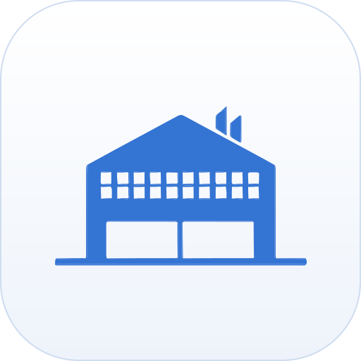
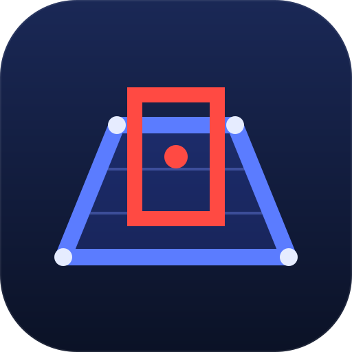
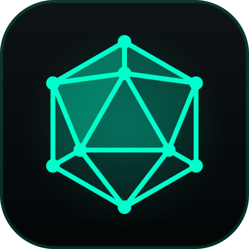

# Hi, I'm Trupal Patel 👋

**Full-stack software engineer. I build products people actually use, from the backend to the pixels.**

 

---

I handle the whole software lifecycle: backend architecture and data pipelines, the interface people touch, and shipping it to production. I don't box myself into frontend or backend, or tie myself to one language.

## 🚀 Live products

| | Product | What it is | Links |
|:-:|---|---|---|
|  | **StoreDesk** | A local-first back office for convenience stores and gas stations: an in-store edge node, a Windows desktop app, an Android barcode scanner, a web dashboard and a cloud relay. | [storedesk.net](https://storedesk.net) · [Product page](https://trupalpatel.com/products/storedesk) |
|  | **LogicSprint** | An Android app with four endless brain games for reflexes, memory, math and focus, with a global Top 10 per game and no login. | [logicsprint.trupalpatel.com](https://logicsprint.trupalpatel.com) · [Product page](https://trupalpatel.com/products/logicsprint) |

## 🧪 Projects

Every project has a case study on [trupalpatel.com](https://trupalpatel.com/projects) and a README with recreated screens.

| | Project | What it is | |
|:-:|---|---|:-:|
|  | **[RetailSync](https://github.com/comp596-spring-2026/RetailSync)** | Multi-tenant retail SaaS: POS imports, bank statements and QuickBooks in one workspace (team project) | [Case study](https://trupalpatel.com/projects/retailsync) |
|  | **[Web Warehouse](https://github.com/TRUPALIX9/web-warehouse)** | Inventory, purchase orders and warehouse slots, with a 3D item preview | [Case study](https://trupalpatel.com/projects/web-warehouse) |
|  | **[Card Snap](https://github.com/TRUPALIX9/card-snap)** | Business-card scanner: a React Native (Expo) app and a Node.js OCR API | [Case study](https://trupalpatel.com/projects/card-snap) |
|  | **[Shipping Agent Assistant](https://github.com/TRUPALIX9/Shipping-Agent-AWS)** | Streamlit chat front end for an AWS Bedrock shipping agent (team project) | [Case study](https://trupalpatel.com/projects/shipping-agent-aws) |
|  | **[Fire Forecasting](https://github.com/TRUPALIX9/fire-forecasting)** | Wildfire risk dashboard prototype: forecast map, risk charts and site table on sample data | [Case study](https://trupalpatel.com/projects/fire-forecasting) |
|  | **[ZoneWatch](https://github.com/TRUPALIX9/Motion-Detection-Windows-App)** | Zone-based motion detection for ONVIF IP cameras, with PTZ control (C# WinForms, EmguCV) | [Case study](https://trupalpatel.com/projects/motion-detection) |
|  | **[Gatelog](https://github.com/TRUPALIX9/Vehicle-Log-Managment-System)** | Proof-of-concept Windows installer and updater for a vehicle-log server stack | [Case study](https://trupalpatel.com/projects/vehicle-log) |
|  | **[WebGL Academic Presentation](https://github.com/TRUPALIX9/comp-599-webgl)** | A seminar slide deck where every slide runs its own live Three.js scene | [Case study](https://trupalpatel.com/projects/comp-599-webgl) |
|  | **[File System Engine](https://github.com/TRUPALIX9/file-system-engine)** | Electron desktop file manager with a dual-pane Transfer Hub and a treemap disk analyzer | [Case study](https://trupalpatel.com/projects/file-system-engine) |

## 💼 Experience

### Founding Software Engineer @ **Allyvia** _(Jul 2025 – Apr 2026)_
* **SaaS architecture:** Architected and built a multi-tenant workflow and CRM SaaS platform from scratch with **React 19 + TypeScript** on the frontend and **Django 5.0 + Django REST Framework** with **PostgreSQL** on the backend.
* **Asynchronous pipelines:** Built a background worker on **AWS SQS** queues to offload QuickBooks Online accounting syncs and webhook ingestion, keeping core web server latency under 200ms.
* **Integrations and security:** Automated secure employee onboarding with database-level encryption (`django-fernet-fields`) for OAuth token cycles, clock-in kiosk sessions and Google Drive folder provisioning.
* **Fuzzy search:** Sped up search across large datasets with PostgreSQL trigram similarity search, with a SQLite fallback.

### Software Engineer @ **AIVID.AI** _(Jan 2023 – Jun 2025)_
* **Scale:** Deployed and maintained device-management portals and real-time analytics dashboards across **200+ enterprise production sites** with Angular, React, Node.js and Python.
* **Search:** Made Elasticsearch retrieval **~25% faster** through index mapping and aggregation optimizations.
* **Edge services in C#:** Built a C# / WinForms NSSM service manager with multi-ISP failover, keeping **99% stream uptime** across edge camera networks.
* **Computer vision:** Built barcode-triggered video capture bots with C# and EmguCV, cutting fraudulent shipping return claims by **90%**.

### Frontend Software Engineer @ **InfoLabz IT Services** _(Jan 2022 – Dec 2022)_
* Built modular, responsive layouts in React.js and managed complex client state with Redux.
* Integrated REST APIs and optimized components for client-side performance.

More detail in the [experience deep dives](https://trupalpatel.com/#experience).

## 🛠️ Tech

| Category | Technologies |
| :--- | :--- |
| **Languages** | TypeScript, JavaScript, Python, C#, C++, Dart, SQL, HTML, CSS |
| **Frontend** | React 19, Next.js, Angular, Vite, React Native (Expo), Flutter |
| **State and styling** | Redux Toolkit, React Query, Material UI, Tailwind CSS, Framer Motion |
| **Backend and APIs** | Node.js, Express, Django, Django REST Framework, FastAPI, Streamlit, WebSockets, GraphQL |
| **Data** | PostgreSQL, MongoDB, MySQL, SQLite, Elasticsearch, Redis, Supabase |
| **Cloud and DevOps** | AWS (SQS, Bedrock, EC2, Lambda, S3), Google Cloud, Docker, GitHub Actions, Vercel |
| **3D, vision and devices** | Three.js, React Three Fiber, EmguCV / OpenCV, ONVIF cameras, Electron, Arduino |

## 🏅 Certifications

AI Mastery Certificate (Cal Poly Digital Transformation Hub) · Meta Front-End Developer Specialization ([badge](https://www.credly.com/badges/8acca941-de83-466e-b754-0518b0f25e25)) · Elastic Stack · AWS S3 Basics · and more on **[trupalpatel.com/certifications](https://trupalpatel.com/certifications)**.

## 📬 Let's build something

**[trupalpatel.com](https://trupalpatel.com)** · **[trupal.work@gmail.com](mailto:trupal.work@gmail.com)** · **[LinkedIn](https://www.linkedin.com/in/trupalix)**

  

